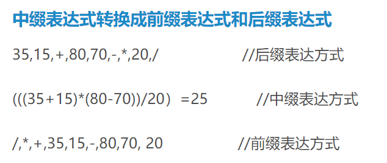
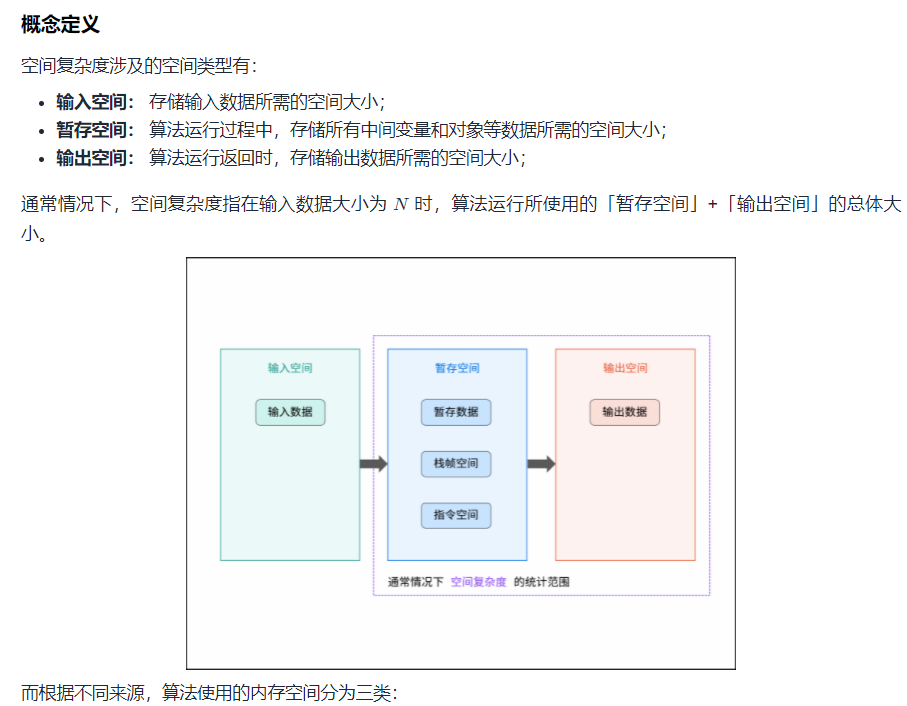
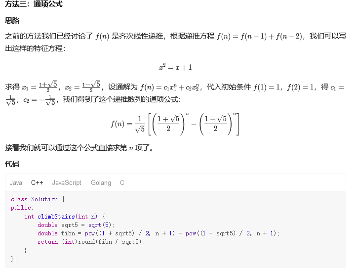
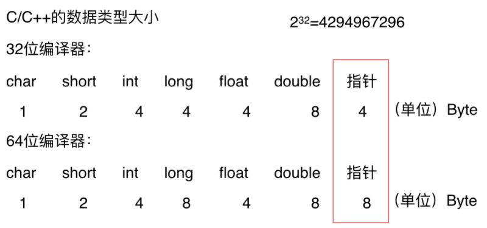

记录一些暂时未分类的笔记

<!-- more -->              
                                                      
# Temp Note
- [Temp Note](#temp-note)
  - [argc、argv的具体含义](#argcargv的具体含义)
  - [前缀表达式与后缀表达式问题](#前缀表达式与后缀表达式问题)
  - [c++模板类的声明与实现的分离编译问题](#c模板类的声明与实现的分离编译问题)
  - [typedef的用法](#typedef的用法)
  - [算法的时间复杂度问题](#算法的时间复杂度问题)
    - [计算算法的时间复杂度](#计算算法的时间复杂度)
    - [递归算法的时间复杂度分析](#递归算法的时间复杂度分析)
    - [算法的空间复杂度](#算法的空间复杂度)
  - [快速幂算法](#快速幂算法)
  - [递归算法空间复杂度分析](#递归算法空间复杂度分析)
  - [c++内存管理](#c内存管理)
  - [sizeof()与strlen()以及字节对齐问题](#sizeof与strlen以及字节对齐问题)
  - [strlen()与sizeof()](#strlen与sizeof)
  - [有关ios::sync_with_stdio(false)；和 cin.tie(nullptr)；的介绍与意](#有关iossync_with_stdiofalse和-cintienullptr的介绍与意)

[面经](https://interviewguide.cn/notes/03-hunting_job/02-interview/01-01-01-%E5%9F%BA%E7%A1%80%E8%AF%AD%E6%B3%95.html)

## argc、argv的具体含义 

> argc和argv参数在用命令行编译程序时有用。main( int argc, char* argv[], char **env ) 中 
> 
- 第一个参数，int型的argc，为整型，用来统计程序运行时发送给main函数的命令行参数的个数，在VS中默认值为1。 
- 第二个参数，char*型的argv[]，为字符串数组，用来存放指向的字符串参数的指针数组，每一个元素指向一个参数。各成员含义如下： 
> argv[0]指向程序运行的全路径名 
argv[1]指向在DOS命令行中执行程序名后的第一个字符串 
argv[2]指向执行程序名后的第二个字符串 
argv[3]指向执行程序名后的第三个字符串 
argv[argc]为NULL 

- 第三个参数，char**型的env，为字符串数组。env[]的每一个元素都包含ENVVAR=value形式的字符串，其中ENVVAR为环境变量，value为其对应的值。平时使用到的比较少。

##  前缀表达式与后缀表达式问题




[基于栈实现简单表达式的计算](https://www.cnblogs.com/tech-bird/p/3971555.html)


## c++模板类的声明与实现的分离编译问题

> 模板不支持分离编译, 把你模板类的声明和实现放到.h文件里面
C++中每一个对象所占用的空间大小，是在编译的时候就确定的，在模板类没有真正的被使用之前，编译器是无法知道，模板类中使用模板类型的对象的所占用的空间的大小的。
只有模板被真正使用的时候，编译器才知道，模板套用的是什么类型，应该分配多少空间。
在分离式编译的环境下，编译器编译某一个.cpp文件时并不知道另一个.cpp文件的存在，也不会去查找（当遇到未决符号时它会寄希望于连接器）。
这种模式在没有模板的情况下运行良好，但遇到模板时就傻眼了，因为模板仅在需要的时候才会实例化出来，所以，当编译器只看到模板的声明时，它不能实例化该模板，只能创建一个具有外部连接的符号并期待连接器能够将符号的地址决议出来。
然而当实现该模板的.cpp文件中没有用到模板的实例时，编译器懒得去实例化，所以，整个工程的.obj中就找不到一行模板实例的二进制代码，于是连接器也黔驴技穷了。

[https://blog.csdn.net/weixin_40539125/article/details/83375452](https://blog.csdn.net/weixin_40539125/article/details/83375452)

[https://www.cnblogs.com/qlwy/archive/2012/03/21/2410045.html](https://www.cnblogs.com/qlwy/archive/2012/03/21/2410045.html)


## typedef的用法

- 定义一种类型的别名，而不只是简单的宏替换。可以用作同时声明指针型的多个对象。

  `typedef char* PCHAR;` // 一般用大写
  `PCHAR pa, pb;` // 可行，同时声明了两个指向字符变量的指针

- 用在旧的C的代码中,帮助struct。以前的代码中，声明struct新对象时，必须要带上struct，即形式为： struct 结构名 对象名，如：

  ```c++
  struct tagPOINT1  {  
      int x;  
      int y;  
  };  
  struct tagPOINT1 p1;   
  ```

  ```c++
  typedef struct tagPOINT  {  
    int x;  
    int y;  
  }POINT;  
  POINT p1; // 这样就比原来的方式少写了一个struct，比较省事，尤其在大量使用的时候  
  
  ```

- 用typedef来定义与平台无关的类型     
  > 比如定义一个叫 REAL 的浮点类型，在目标平台一上，让它表示最高精度的类型为：
  typedef long double REAL; 
  在不支持 long double 的平台二上，改为：
  typedef double REAL; 
  在连 double 都不支持的平台三上，改为：
  typedef float REAL; 
  也就是说，当跨平台时，只要改下 typedef 本身就行，不用对其他源码做任何修改。
  标准库就广泛使用了这个技巧，比如size_t。
  另外，因为typedef是定义了一种类型的新别名，不是简单的字符串替换，所以它比宏来得稳健

- 为复杂的声明定义一个新的简单的别名。方法是：在原来的声明里逐步用别名替换一部分复杂声明，如此循环，把带变量名的部分留到最后替换，得到的就是原声明的最简化版。举例：

  > 原声明：int *(*a[5])(int, char*);
  变量名为a，直接用一个新别名pFun替换a就可以了：
  typedef int *(*pFun)(int, char*); 
  原声明的最简化版：
  pFun a[5];

**陷阱一：**

typedef是定义了一种类型的新别名，不同于宏，它不是简单的字符串替换。比如：
先定义：
`typedef char* PSTR;`
然后：
`int mystrcmp(const PSTR, const PSTR);`

`const PSTR`实际上相当于`const char*`吗？不是的，它实际上相当于`char* const`。
**原因在于const给予了整个指针本身以常量性**，也就是形成了常量指针`char* const`。
简单来说，记住当const和typedef一起出现时，typedef不会是简单的字符串替换就行。

**陷阱二：**
typedef在语法上是一个存储类的关键字（如auto、extern、mutable、static、register等一样），虽然它并不真正影响对象的存储特性，如：
typedef static int INT2; //不可行
编译将失败，会提示“指定了一个以上的存储类”。

**typedef 与 #define的区别**

通常讲，typedef要比#define要好，特别是在有指针的场合。请看例子：

```c++
  typedef char *pStr1;  
  #define pStr2 char *;  
  pStr1 s1, s2;  
  pStr2 s3, s4;  
```
在上述的变量定义中，s1、s2、s3都被定义为char *，而s4则定义成了char，  
根本原因就在于#define只是简单的字符串替换而typedef则是为一个类型起新名字。

```c++
  typedef char * pStr;  
  char string[4] = "abc";  
  const char *p1 = string;  
  const pStr p2 = string;  
  p1++;  
  p2++;  
```

p2++出错了。这个问题再一次提醒我们：typedef和#define不同，它不是简单的文本替换。  

上述代码中const pStr p2并不等于const char * p2。const pStr p2和const long x本质上没有区别，都是对变量进行只读限制，

只不过此处变量p2的数据类型是我们自己定义的而不是系统固有类型而已。因此，const pStr p2的含义是：**限定数据类型为char \*的变量p2为只读**，p2为一个常指针，因此p2++错误。

## 算法的时间复杂度问题

### 计算算法的时间复杂度
### 递归算法的时间复杂度分析

**求x的n次方**

```c++
//for循环 O(n)
int function2(int x, int n) {
    if (n == 0) {
        return 1; // return 1 同样是因为0次方是等于1的
    }
    return function2(x, n - 1) * x;
}
//一般性递归 O(n)   递归树的总节点数依然为n-1
int function2(int x, int n) {
    if (n == 0) {
        return 1; // return 1 同样是因为0次方是等于1的
    }
    return function2(x, n - 1) * x;
}
//版本二  O(n) 
int function3(int x, int n) {
    if (n == 0) {
        return 1;
    }
    if (n % 2 == 1) {
        return function3(x, n / 2) * function3(x, n / 2)*x;
    }
    return function3(x, n / 2) * function3(x, n / 2);
}
// 版本3 O(logN) 
int function4(int x, int n) {
    if (n == 0) {
        return 1;
    }
    int t = function4(x, n / 2);// 这里相对于function3，是把这个递归操作抽取出来
    if (n % 2 == 1) {
        return t * t * x;
    }
    return t * t;
}
```
**着重理解递归算法版本3，联系快速幂算法求矩阵幂**

### 算法的空间复杂度



- 斐波那契数列
```c++
//版本1
int fibonacci(int i) {
       if(i <= 0) return 0;
       if(i == 1) return 1;
       return fibonacci(i-1) + fibonacci(i-2);
}
```
- 一棵深度为K的二叉树的节点数为2^k -1,故而时间复杂度为O(2^n)
- 
```c++
// 版本二
int fibonacci(int first, int second, int n) {
    if (n <= 0) return 0;
    if (n < 3)  return 1;
    else if (n == 3) {
        return first + second;
    }else {
        return fibonacci(second, first + second, n - 1);
    }
}
```
**注意递归算法版本二的写法**

## 快速幂算法
```c++
// 版本3 快速幂算法
class Solution {
public:
    const int MOD = 1000000007;

    vector<vector<long>> multiply(vector<vector<long>>& a, vector<vector<long>>& b) {
        vector<vector<long>> c{{0, 0}, {0, 0}};
        for (int i = 0; i < 2; i++) {
            for (int j = 0; j < 2; j++) {
                c[i][j] = (a[i][0] * b[0][j] + a[i][1] * b[1][j]) % MOD;
            }
        }
        return c;
    }

    vector<vector<long>> pow(vector<vector<long>>& a, int n) {
        vector<vector<long>> ret{{1, 0}, {0, 1}};
        while (n > 0) {
            /*&是位与操作符，n&1,是将n的二进制形式与00000000 00000001按位做与操作。
            这时，只要n的最右边一位是1，结果就不是0，为true  相当于 n%2==1*/
            if (n & 1) {//处理奇数情况
                ret = multiply(ret, a);
            }
            n >>= 1;//注意快速幂算法求矩阵幂的方法
            a = multiply(a, a);
        }
        return ret;
    }
    
    int fib(int n) {
        if (n < 2) {
            return n;
        }
        vector<vector<long>> q{{1, 1}, {1, 0}};
        vector<vector<long>> res = pow(q, n - 1);
        return res[0][0];
    }
}
```


若依据图中推理
`vector<vector<long>> res = pow(q, n);`    
因为 f(2)=f(1)=1



## 递归算法空间复杂度分析
*这里相当于用first和second来记录当前相加的两个数值，此时就不用两次递归了。  
因为每次递归的时候n减1，即只是递归了n次，所以时间复杂度是 O(n)
同理递归的深度依然是n，每次递归所需的空间也是常数，所以空间复杂度依然是O(n)*
```c++
//二分查找的递归实现
int binary_search( int arr[], int l, int r, int x) {
    if (r >= l) {
        int mid = l + (r - l) / 2;
        if (arr[mid] == x)
            return mid;
        if (arr[mid] > x)
            return binary_search(arr, l, mid - 1, x);
        return binary_search(arr, mid + 1, r, x);
    }
    return -1;
}
```

**解法3**

- 每次递归的空间复杂度可以看出主要就是参数里传入的这个**arr数组**，但需要注意的是在C/C++中函数传递数组参数，不是整个数组拷贝一份传入函数而是传入的数组首元素地址

- 也就是说每一层递归都是公用一块数组地址空间的，所以 每次递归的空间复杂度是常数即：O(1)
- 再来看递归的深度，二分查找的递归深度是logn ,递归深度就是调用栈的长度，那么这段代码的空间复杂度为 1 * logn = O(logn)
- 注意所用的语言在传递函数参数的时，是拷贝整个数值还是拷贝地址，如果是拷贝整个数值那么该二分法的空间复杂度就是O(n\log n)

## c++内存管理
**一个由C/C++编译的程序占用的内存分为以下几个部分：**
- 栈区(Stack) ：由编译器自动分配释放，存放函数的参数值，局部变量的值等，其操作方式类似于数据结构中的栈。**由高地址向低地址存储**
- 堆区(Heap) ：一般由程序员分配释放，若程序员不释放，程序结束时可能由OS收回，new的对象
- 未初始化数据区： 存放未初始化的全局变量和静态变量
- 初始化数据区：存放已经初始化的全局变量和静态变量
- 程序代码区(Text)：存放函数体的二进制代码
  

*平台原因：不是所有的硬件平台都能访问任意内存地址上的任意数据，某些硬件平台只能在某些地址处取某些特定类型的数据，否则抛出硬件异常。为了同一个程序可以在多平台运行，需要内存对齐*
*硬件原因：经过内存对齐后，CPU访问内存的速度大大提升。CPU读取内存不是一次读取单个字节，而是一块一块的来读取内存，块的大小可以是2，4，8，16个字节，具体取多少个字节取决于硬件*

## sizeof()与strlen()以及字节对齐问题
```c++
struct MyStruct{
double dda1;
char dda;
int type
}；
```
- *先为第一个成员dda1分配空间，其起始地址跟结构的起始地址相同（刚好偏移量0刚好为sizeof(double)的倍数），该成员变量占用sizeof(double)=8个字节*

- *接下来为第二个成员dda分配空间，这时下一个可以分配的地址对于结构的起始地址的偏移量为8，是sizeof(char)的倍数，所以把dda存放在偏移量为8的地方满足对齐方式，该成员变量占用sizeof(char)=1个字节*  
- *接下来为第三个成员type分配空间，**这时下一个可以分配的地址对于结构的起始地址的偏移量为9，不是sizeof(int)=4的倍数，为了满足对齐方式对偏移量的约束问题**，VC自动填充3个字节（这三个字节没有放什么东西）,这时下一个可以分配的地址对于结构的起始地址的偏移量为12，刚好是sizeof(int)=4的倍数，所以把type存放在偏移量为12的地方，该成员变量占用sizeof(int)=4个字节* 
- *这时整个结构的成员变量已经都分配了空间，总的占用的空间大小为：8+1+3+4=16，**刚好为结构的字节边界数,即结构中占用最大空间的类型所占用的字节数sizeof(double)=8）的倍数，所以没有空缺的字节需要填充**。所以整个结构的大小为：sizeof(MyStruct)=8+1+ 3+4=16，其中有3个字节是VC自动填充的，没有放任何有意义的东西*
```c++
struct MyStruct
{
//偏移量为0，满足对齐方式，dda占用1个字节
char dda; 
/*
    下一个可用的地址的偏移量为1，不是sizeof(double)=8的倍数，
    需要补足7个字节才能使偏移量变为8（满足对齐方式），
    因此VC自动填充7个字节，dda1存放在偏移量为8的地址上，它占用8个字节。
*/
double dda1;
/*
    下一个可用的地址的偏移量为16，是sizeof(int)=4的倍数，满足int的对齐方式，所以不需要VC自动填充，type存放在偏移量为16的地址上，它占用4个字节。
*/
int type； 
}；
```

*所有成员变量都分配了空间，空间总的大小为1+7+8+4=20，**不是结构的节边界数,
即结构中占用最大空间的类型所占用的字节数sizeof(double)=8）的倍数**，
所以需要填充4个字节，以满足结构的大小为sizeof(double)=8的倍数。
所以该结构总的大小为：sizeof(MyStruc)为1+7+8+4+4=24。
其中总的有7+4=11个字节是VC自动填充的，没有放任何有意义的东西。*

## strlen()与sizeof()

1. strlen(char *)是个函数，其运算结果需要在运行的时候才能计算出来，并且参数只能是char*类的字符指针（字符数组名也可以，相当于一个字符的指针）。该函数的功能是获得字符串的长度，从字符串的第一个字符开始遍历直至遇到NULL结束符，NULL结束符不占用字符串的长度。
2. sizeof()是运算符，其类型在头文件typedef中定义为unsigned int ；参数可以是指针、数组、类型、对象、函数等；该类型保证能容纳实现所建立的最大对象的字节大小；在编译的过程中计算，因此不能用来返回动态分配内存空间的大小，sizeof 返回类型以及静态分配的对象、结构、数组所占的内存空间，返回值跟对象、结构、数组所存储的内容没有关系。 
    ***具体而言，当参数分别如下时，sizeof返回的值表示的含义如下：
    数组——编译时分配的数组空间大小；
    指针——存储该指针所用的空间大小,存储该指针的地址的长度，是长整型，应该为4
    类型——该类型所占的空间大小；
    对象——对象的实际占用空间大小；
    函数——函数的返回类型所占的空间大小。函数的返回类型不能是void***

3. sizeof可以用类型做参数，`strlen只能用char*做参数，且必须是以''\0''结尾的。 sizeof还可以用函数做参数，比如： short f(); printf("%d\n", sizeof(f())); 输出的结果是sizeof(short)，即2`
4. 数组做`sizeof`的参数不退化，传递给strlen就退化为指针了。

5. 大部分编译程序 在编译的时候就把sizeof计算过了`是类型或是变量的长度这就是sizeof(x)可以用来定义数组维数的原因 char str[20]="0123456789"; int a=strlen(str); //a=10; int b=sizeof(str); //而b=20;` 

6. strlen的结果要在运行的时候才能计算出来，时用来计算字符串的长度，不是类型占内存的大小。 

7. sizeof后如果是类型必须加括弧，如果是变量名可以不加括弧。这是因为sizeof是个操作符不是个函数。 

8. 当适用了于一个结构类型时或变量， sizeof 返回实际的大小， 当适用一静态地空间数组， sizeof 归还全部数组的尺寸。 sizeof 操作符不能返回动态地被分派了的数组或外部的数组的尺寸

9. 数组作为参数传给函数时传的是指针而不是数组，传递的是数组的首地址， 如：
```c++
fun(char [8])
fun(char []) 
都等价于 fun(char *) 在C++里参数传递数组永远都是传递指向数组首元素的指针，
编译器不知道数组的大小


char str[20]="0123456789";
int a=strlen(str); 

a=10; >>>> strlen 计算字符串的长度，以结束符 0x00 为字符串结束。 
int b=sizeof(str); 

而b=20; >>>> sizeof 计算的则是分配的数组 str[20] 所占的内存空间的大小，
不受里面存储的内容改变,上面是对静态数组处理的结果，如果是对指针，结果就不一样了 


char* ss = "0123456789";
sizeof(ss) 结果 4 ，

ss是指向字符串常量的字符指针，
sizeof 获得的是一个指针的之所占的空间,应该是 长整型的，所以是4 

sizeof(*ss) 结果 1 *ss是第一个字符 
其实就是获得了字符串的第一位'0' 所占的内存空间，是char类 型的，占了 1 位 strlen(ss)= 10 
>>>> 如果要获得这个字符串的长度，则一定要使用 strlen()。
```

 ## 有关ios::sync_with_stdio(false)；和 cin.tie(nullptr)；的介绍与意

 **整体来说它们是对C++输入输出流的优化（可以提高速度），但同时也会产生一定的副作用**   

遇到大数据量（cin、cout 数据量级达到 1e5、1e6 ），     

因为考虑 IO 性能报错 TLE，故选择 scanf、printf 替代 cin、cout

```c++
#include <iostream>
int main() {
  std::ios::sync_with_stdio(false);
  cin.tie(nullptr);
  ... 
}
```

**ios::sync_with_stdio(false)**

`ios::sync_with_stdio(false);`是C++的输入输出流（iostream）是否兼容C的输入输出（stdio）的开关。  

> 因为C++中的std :: cin和std :: cout为了兼容C，保证在代码中同时出现std :: cin和scanf或std :: cout和printf时输出不发生混乱，
> 所以C++用一个流缓冲区来同步C的标准流。通过std :: ios_base :: sync_with_stdio函数可以解除这种同步，
> 让std :: cin和std :: cout不再经过缓冲区，自然就节省了许多时间。
> 当设置为false时，cin就不能和scanf，sscanf, getchar, fgets等同时使用。
> 据说，endl用”\n”代替和cout使用，也可节约时间。

**cin.tie(nullptr)**

> 因为std :: cin默认是与std :: cout绑定的，所以每次操作的时候（也就是调用”<<”或者”>>”）都要刷新（调用flush），
> 这样增加了IO的负担，通过tie(nullptr)来解除std :: cin和std :: cout之间的绑定，来降低IO的负担使效率提升。

**cin.tie(NULL);和cin.tie(nullptr); 的区别**

> nullptr是c++11中的关键字，表示空指针
NULL是一个宏定义，在c和c++中的定义不同，c中NULL为（void*)0,而c++中NULL为整数0
nullptr是一个字面值常量，类型为std::nullptr_t,空指针常数可以转换为任意类型的指针类型。
在c++中（void *）不能转化为任意类型的指针，即 int *p=(void*)是错误的，
但int *p=nullptr是正确的。原因是对于函数重载：若c++中 （void *）支持任意类型转换，函数重载时将出现问题。
下列代码中fun(NULL)将不能判断调用哪个函数

```c++
void fun(int i){cout<<"1";};
void fun(char *p){cout<<"2";};
int main()
{
    fun(NULL);        //输出1，c++中NULL为整数0
    fun(nullptr);     //输出2，nullptr 为空指针常量。是指针类型
}
```